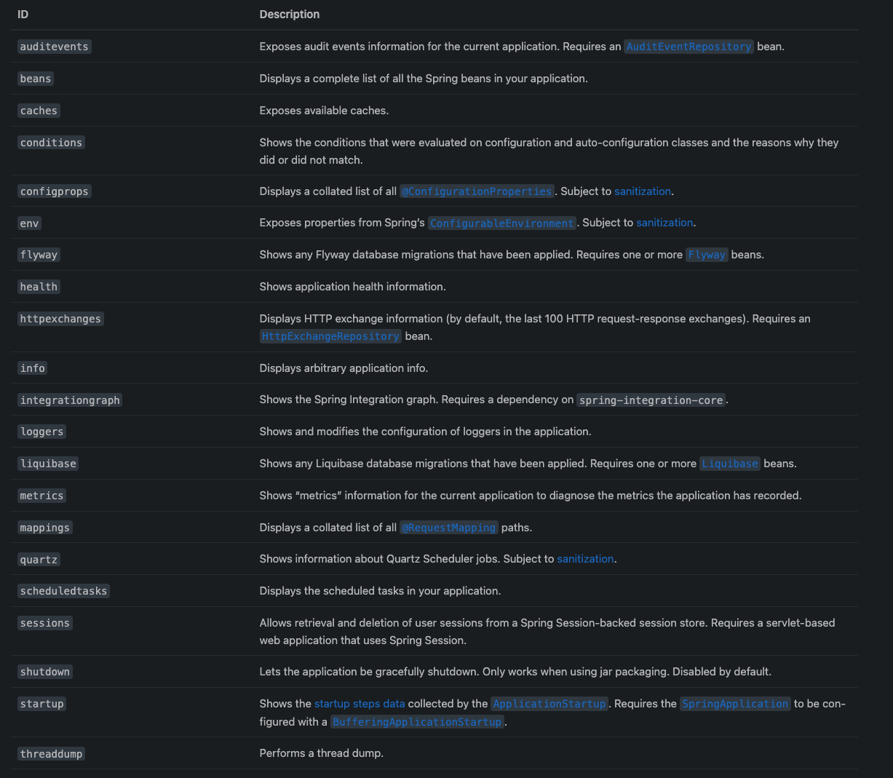
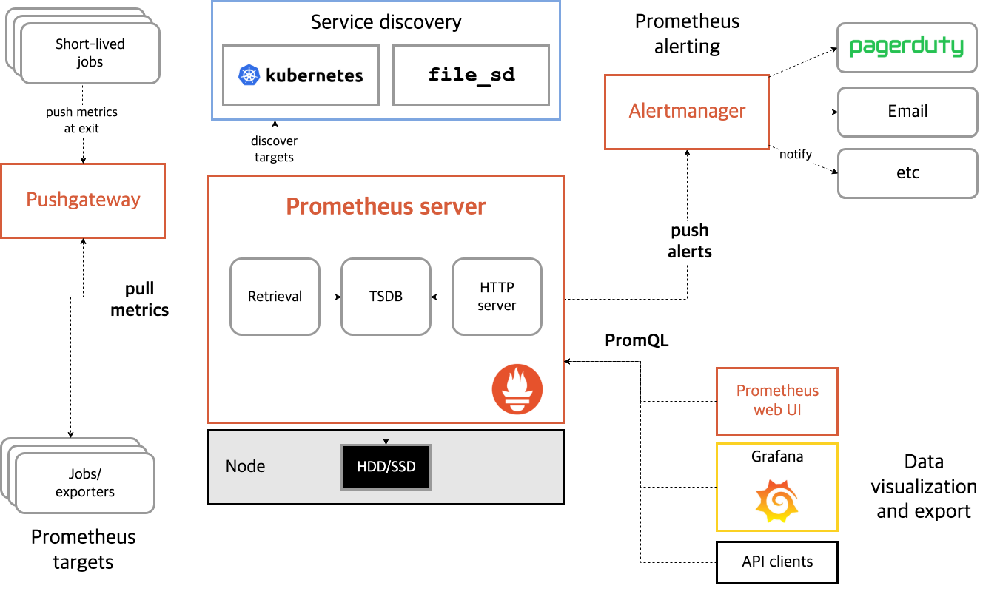
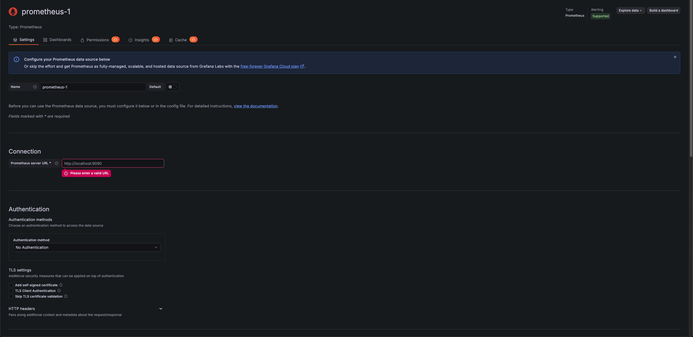
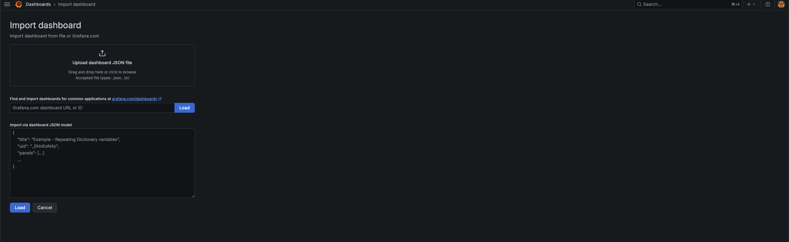
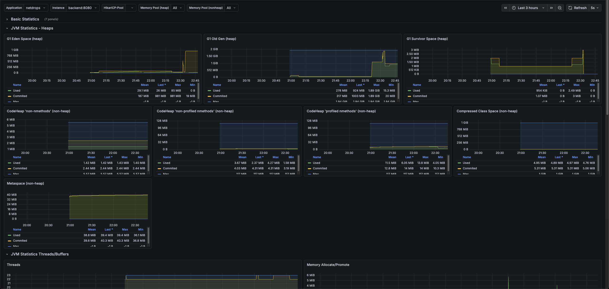

## 들어가며
그동안 프로젝트를 진행하며 모니터링을 고려하지 않아 성능을 명확하게 검증하기 어려웠다. 개선이나 최적화의 기준이 되는 수치 또한 부재했기 때문에 이를 보완하기 위해 모니터링과 부하 테스트를 간단하게 도입해보고 공부해보고자 한다.

이번 글에서는 Spring Boot Actuator와 Prometheus로 메트릭을 수집하고, Grafana를 활용해 시각화하는 과정을 다룬다.

## Spring Boot Actuator
Spring Boot는 우리의 프로젝트를 배포할때 모니터링과 관리를 도와주는 기능을 제공한다. 이를 **Production-ready**라고 하는데 Spring Boot Actuator는 이러한 프로덕션 준비 기능을 매우 편리하게 사용할 수 있는
Spring Boot 애플리케이션의 모니터링 및 관리를 지원하는 라이브러리이다.

Actuator는 의존성만 주입받으면 기본적으로 활성화 된다.

```
implementation 'org.springframework.boot:spring-boot-starter-actuator'
```

의존성을 추가하면 다음과 같은 여러 내장 엔드포인트가 포함되어있고 이중에서 필요한 것을 선택하여 포함시키면 되는 방식이다.



추가적으로 애플리케이션이 웹 애플리케이션(MVC, Webflux, Jersey)인 경우 다음과 같은 엔드포인트를 추가적으로 사용활 수 있다.  


여기서 나는 프로메테우스를 사용할 것이기에 의존성을 추가해준다.
```
implementation 'io.micrometer:micrometer-registry-prometheus' 
```

이렇게 되면 Spring 애플리케이션에서 Actuator와 Micrometer를 통해 메트릭을 수집하고, `/actuator/prometheus` 엔드포인트로 Prometheus가 이를 scrape할 수 있도록 노출할 수 있게 되었다.

## Prometeous

Prometheus는 오픈소스 모니터링 시스템으로, 시계열(Time Series) 데이터를 수집하고 저장하는 역할을 한다.

위 아키텍처를 보면 Prometheus server 내부에 세 가지 주요 컴포넌트가 있다. Retrieval이 메트릭을 가져오고, TSDB(Time Series Database)가 이를 시계열 데이터로 저장하며, HTTP server가 외부에서 이 데이터를 조회할 수 있도록 API를 제공한다. 저장된 데이터는 Node의 HDD/SSD에 영속화된다.

가장 중요한 특징은 Pull 방식이다. Prometheus가 직접 Jobs/exporters(모니터링 대상)의 엔드포인트에 주기적으로 접근해서 메트릭을 긁어온다. 우리가 Spring Boot에서 /actuator/prometheus로 메트릭을 노출해두면, Prometheus의 Retrieval이 이 엔드포인트를 scrape하는 구조다. 다만 배치 작업처럼 금방 종료되는 Short-lived jobs의 경우에는 Pull할 타이밍을 놓칠 수 있기 때문에, Pushgateway를 통해 종료 시점에 메트릭을 push하는 방식도 지원한다.


정리하면 Prometheus의 데이터 흐름은 이렇다: 타겟 발견(Service discovery) → 메트릭 수집(Pull/Retrieval) → 저장(TSDB) → 조회 및 시각화(Grafana, Web UI) / 알림(Alertmanager).

기존 Docker-compose.yml에 프로메테우스 이미지를 추가해준다. 여기서 volume으로 설정해놓은건 prometheus.yml인데 수집을 어떤 서버에서, 어떤 몇초 주기로 프로메테우스에서 수집할지 설정해놓는 설정 파일이다.


```
prometheus:
  image: prom/prometheus:latest
  ports:
    - "9090:9090"
  volumes:
    - ./prometheus.yml:/etc/prometheus/prometheus.yml
  depends_on:
    - backend
  restart: unless-stopped

```


```
global:
  scrape_interval: 15s

scrape_configs:
  - job_name: 'netdrops-backend'
    metrics_path: '/actuator/prometheus'
    static_configs:
      - targets: ['backend:8080']
```

## Grafana

Grafana는 오픈소스 데이터 시각화 및 대시보드 도구이다. Prometheus가 메트릭을 수집하고 저장하는 역할이라면, Grafana는 그 데이터를 사람이 보기 좋게 시각화해주는 역할을 한다. Prometheus 자체에도 간단한 Web UI가 있지만 PromQL 쿼리를 직접 작성해야 하고, 그래프도 단순해서 실무에서의 모니터링 대시보드로 쓰기엔 부족하다고 한다.

Grafana의 핵심 특징은 데이터소스 독립성이다. Prometheus뿐만 아니라 MySQL, Elasticsearch, InfluxDB 등 다양한 데이터소스를 연결할 수 있고, 하나의 대시보드에서 여러 데이터소스의 메트릭을 함께 볼 수도 있다. 

Docker Compose에 Grafana를 추가하자.

```
  grafana:
    image: grafana/grafana:latest
    ports:
      - "3001:3000"
    volumes:
      - grafana-data:/var/lib/grafana
    depends_on:
      - prometheus
    restart: unless-stopped

```

### 데이터소스 연결

컨테이너를 띄운 뒤 `localhost:3001`로 Grafana에 접속하고, 데이터소스에서 Prometheus를 선택한다. Connection URL에 `http://prometheus:9090`을 입력하면 Grafana가 Prometheus 컨테이너에 접근하여 메트릭을 조회할 수 있게 된다.



### 대시보드 Import

데이터소스 연결이 완료되면 대시보드를 구성해야 한다. Grafana는 커뮤니티에서 공유하는 대시보드를 Import하는 기능을 제공한다.



Dashboards > Import에서 grafana.com에 공유된 대시보드 ID를 입력하거나 JSON 파일을 업로드하면 된다. Spring Boot 애플리케이션 모니터링에 자주 사용되는 **JVM (Micrometer)** 대시보드(ID: 4701)를 Import하고 데이터소스를 Prometheus로 지정하면 바로 사용할 수 있다.

### 대시보드 확인



Import가 완료되면 위와 같이 JVM Statistics 대시보드가 구성된다. Heap 메모리 사용량, Old Gen/Survivor Space, Metaspace, Compressed Class Space 등 JVM의 주요 메모리 지표를 한눈에 확인할 수 있다.

## 마무리

이번 글에서는 Spring Boot Actuator로 메트릭을 노출하고, Prometheus가 이를 수집하며, Grafana로 시각화하는 모니터링 파이프라인을 구축했다. 

이후에는 구축한 모니터링 환경을 기반으로 부하 테스트를 진행하고, 실제 메트릭을 관찰하며 성능을 분석하는 과정을 다뤄보겠다.